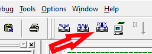
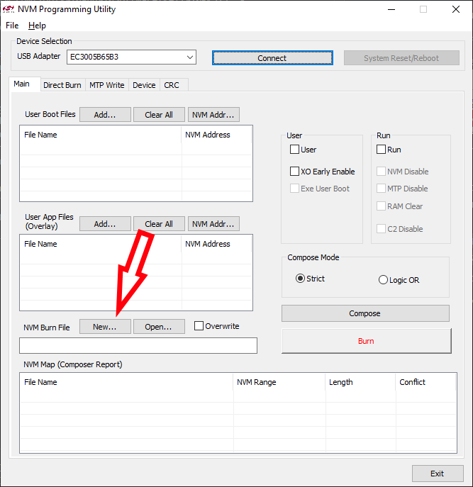
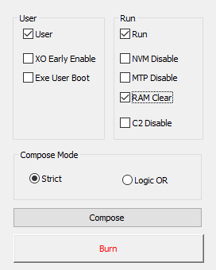

# RF Tracker

### Directory Structure:
- `common/`: Additional library files for the SI 4010
- `docs/`: Documentation images.
- `Schematic/`: Contains all files for the schematic and PCB
- `Software/`: Contains all files for the actual software running on the SI4010 embedded system
    - `bin/`: Project files
    - `out/`: Output files
    - `src/`: The actual code
---

### Assembly Instructions:
Make sure you have all the components listed in [Bill of Materials](ShitboxV4_BOM.xls). Other required componenets and materials not part of the BOM:
- 1x 1x2 2.54mm pitch male header
- 1x 2x5 2.54mm pitch male header
- 1x CR2477 (Any 3.3v battery can be used, but a different battery holder will be required).

#### Assembly steps:
1. Solder the SI 4010 ensuring pin 1 lines up with the astericks on the board.
2. Solder the LEDs, referencing the BOM for placement.
3. Solder the remaining passives, referencing the BOM for placement. The inductor must be soldered on the L1 pad.
4. Solder the button to channel select pad.
5. Solder the headers to the board
6. Solder the battery holder, using the silkscreen markings for orientation.
7. Cut an antenna wire using the instructions below and solder it to the AE1 pad.

#### Antenna Cutting:
If you plan on operating on the 216MHz band, the antenna wire should be 22 gauge and 4.5cm long. If you plan on operating in another band, use [this calculator](https://m0ukd.com/calculators/loaded-quarter-wave-antenna-inductance-calculator/) to determine antenna wire length. Input the frequency in MHz, 0.01 in the coil position field, and 0.6426 in the wire diameter field. You'll then want to input distance values and press the design button until the inductance value is very close to 1µH.

**DISCLAMER:** DO NOT USE A FREQUENCY IF YOU DO NOT HAVE A LICENSE FOR IT.

### Programming & Burning Instructions:
This requires a Windows machine. If you are running on MacOS or Linux, you'll need to use a virtual machine or use a machine with windows installed on it.

You'll also need to connect the Silicon Labs USB Debug Adapter to your PC with a USB-B cable.

You will need to download various software packages to burn the code to the tracker:
- [Silicon Labs IDE](https://www.silabs.com/developers/8-bit-8051-microcontroller-software-studio)
- [Silicon Labs Burn Tools](http://www.silabs.com/Support%20Documents/Software/Si4010_Burn_Tools.exe) * - Note: The *
- [Keil PK51](https://developer.arm.com/Tools%20and%20Software/Keil%20PK51) *- Note: you'll need to input some personal information for this one. There is also an option to purchase the software for commercial use, don't click on that.*

#### Programming and burning steps:
1. Navigate the [Software](Software/bin) folder and open `RF_Tracker.wsp`. This will open the Silicon Labs IDE.
    1. If you are operating on a different band, navigate to the `RF_Tracker.h` file and change the `FREQUENCY` number to the desired frequency in Hz. If you desire to change the channel separation, that is located below and also is also in Hz. **Ensure the numbers end in .0 to avoid issues.**
2. Once the IDE has opened, build the project by clicking the `Compile All` button.  

3. The console at the bottom of the screen should display `OBJECT TO HEXT CONVERSION COMPLETED` if successful.
4. Once the project has been built, put a battery in the RF Tracker and connect the USB Debug adapter to the programming header, making sure the red wire lines up with the `RED GO HERE` text on the PCB. 
5. Open `Si4010_NVM_Burner.exe`, which should have been installed to `C:\SiLabs\MCU\Si4010_NVMProgUtil`
6. Once open, select the USB Debug Adapter from the dropdown menu and press connect.
7. Once connected, press the `New` button next to `NVM Burn File`. Just press save with the default location and name.  

8. Then click `Add` next to `User Boot files`. Navigate to the [Output folder](Software/out/) and select `RF_tracker.hex`
9. Once the file has been added, select the following flags  

10. Press `Compose`.
11. Once composed, connect 6.5v and GND to the 1x2 header on the PCB and press `Burn`. Remove the 6.5v connection once burned to avoid overvolting and cooking the SI4010.
12. Press the disconnect button and remove the USB Debug Adapter from the programming header. The board should be functioning.

### Using the tracker:
The tracker will start up running on channel 1 (if the code is unmodified, this is 216MHz). The default channel separation is 50kHz. The tracker will transmit once a second. This is indicated by the transmit LED.

If you wish the see the channel the tracker is on, press (don't hold!) the channel select button. The channel LED will blink to indicate the selected channel. For example, if the tracker is on channel 3, the LED will blink 3 times.

Changing the channel works as follows:
1. Hold the `Channel Select` button for at least 5 seconds to enter the channel selction mode. Release the button.
    1. While in channel select mode, the tracker will not transmit.
2. The channel LED should now be blinking rapidly. Press the button to increment the channel. If you want to be on channel 3, press the button 3 times. 5 times for channel 5, etc.
3. Once complete, hold the channel select button for 5 seconds to exit channel select mode. Upon exiting, the channel LED will blink to indicate the selected channel. The tracker will start transmitting on the new channel automatically.
    1. If you did not select a channel, the tracker will default to channel 1.